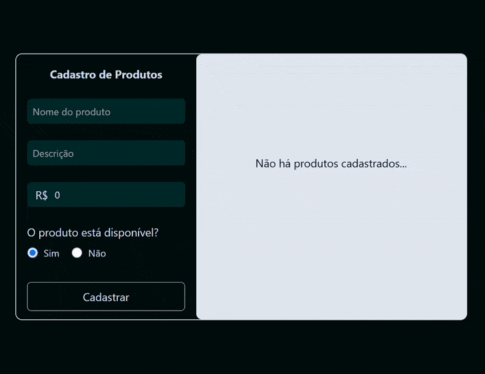
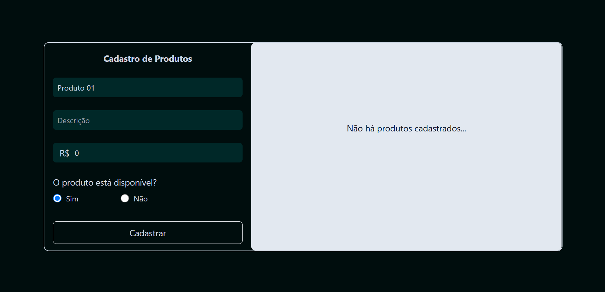
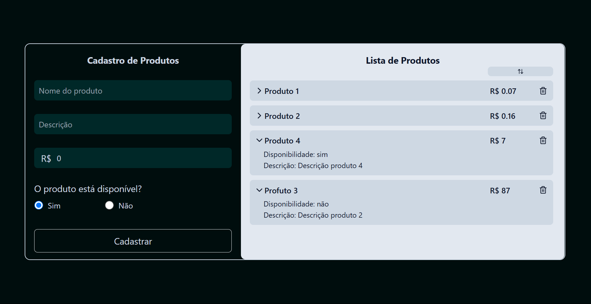

# Cadastro de Produtos

Página de cadastro de produtos feita com React e Node.js.

Stack utilizada:
- React, Node.js, TailwindCSS, Vite.
## Demonstração

<figure>
  
  <figcaption>Cadastro de produtos</figcaption>
</figure>
<figure>
  
  <figcaption>Tela inicial</figcaption>
</figure>
<figure>
  
  <figcaption>Produtos cadastrados</figcaption>
</figure>

## Funcionalidades

- Cadastro de produtos;
- Deletar produtos;
- Componente de produto colapsável. Ao expandir exibe descrição e disponibilidade;
- Botão ordenar lista em ordem crescente de preços;
- Armazenamento local;
- Componentes reutilizáveis;

## Deploy

Para fazer o deploy desse projeto localmente:
```bash
  git clone https://github.com/rebecaaras/cadastro-produtos-react
  cd cadastro-produtos-react
```

Instale as dependências:
```bash
npm install
```

Execute localmente:
```bash
npm run dev
```
Acesse em: http://localhost:5173/


